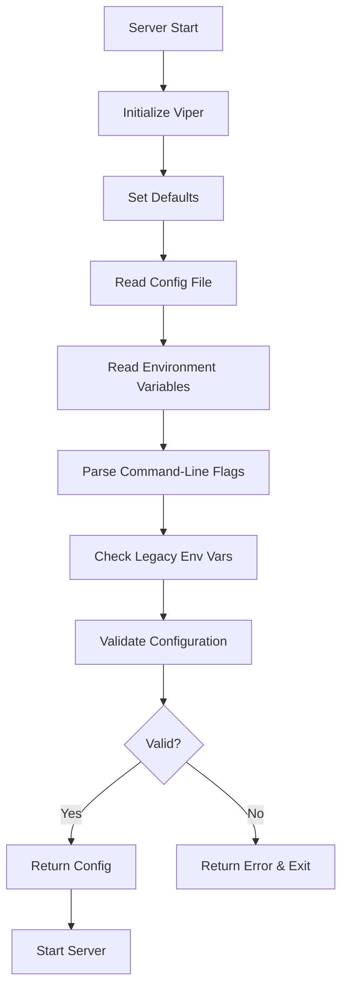

# Design Document: Server Configuration Management

## Overview

This design implements a flexible configuration management system for the Task Manager Server using Viper and pflag libraries. The system supports multiple configuration sources (command-line flags, environment variables, configuration files, and defaults) with a clear precedence order, enabling easy deployment across different environments while maintaining backward compatibility.

### Key Design Principles

1. **Separation of Concerns**: Configuration logic is isolated in a dedicated package (`cmd/server/config`)
2. **Dependency Injection**: Configuration is loaded once at startup and passed to components
3. **Fail-Fast**: Invalid configuration causes immediate startup failure with clear error messages
4. **Security-First**: Sensitive values are masked in logs and display output
5. **Backward Compatibility**: Existing environment variables continue to work with deprecation warnings

## Architecture

### Component Structure

```
cmd/server/
├── config/
│   ├── config.go          # All config logic (struct, loading, validation, display, legacy)
│   └── config_test.go     # All tests
├── main.go                # Updated to use new config system
└── config.yaml.example    # Example configuration file
```

**Rationale for Single File:**
- Config system is focused and cohesive (~300-400 lines total)
- All functions work together closely
- Easier to navigate and maintain
- Avoids premature abstraction

### Configuration Flow



### Precedence Order

1. **Command-line flags** (highest priority)
2. **Environment variables** (`TASKMANAGER_*` prefix)
3. **Configuration file** (YAML/JSON)
4. **Default values** (lowest priority)

## Components and Interfaces

### 1. Config Structure

```go
// Config holds all server configuration
type Config struct {
    Server   ServerConfig   `mapstructure:"server"`
    Database DatabaseConfig `mapstructure:"database"`
    JWT      JWTConfig      `mapstructure:"jwt"`
}

// ServerConfig holds HTTP server settings
type ServerConfig struct {
    Port int    `mapstructure:"port"`
    Host string `mapstructure:"host"`
}

// DatabaseConfig holds database settings
type DatabaseConfig struct {
    Path string `mapstructure:"path"`
}

// JWTConfig holds JWT authentication settings
type JWTConfig struct {
    Secret     string        `mapstructure:"secret"`
    Expiration time.Duration `mapstructure:"expiration"`
}
```

### 2. Configuration Loading

```go
// LoadConfig loads configuration from all sources with proper precedence
func LoadConfig() (*Config, error) {
    v := viper.New()
    
    // 1. Set defaults
    setDefaults(v)
    
    // 2. Configure config file search
    v.SetConfigName("config")
    v.SetConfigType("yaml")
    v.AddConfigPath(".")
    v.AddConfigPath("/etc/taskmanager/")
    v.AddConfigPath("$HOME/.taskmanager/")
    
    // 3. Read config file (optional)
    if err := v.ReadInConfig(); err != nil {
        if _, ok := err.(viper.ConfigFileNotFoundError); !ok {
            return nil, fmt.Errorf("error reading config file: %w", err)
        }
        // Config file not found is OK, continue with other sources
    }
    
    // 4. Environment variables
    v.SetEnvPrefix("TASKMANAGER")
    v.SetEnvKeyReplacer(strings.NewReplacer(".", "_"))
    v.AutomaticEnv()
    
    // 5. Bind command-line flags
    bindFlags(v)
    
    // 6. Check legacy environment variables
    handleLegacyEnvVars(v)
    
    // 7. Unmarshal into Config struct
    var cfg Config
    if err := v.Unmarshal(&cfg); err != nil {
        return nil, fmt.Errorf("failed to unmarshal config: %w", err)
    }
    
    // 8. Validate configuration
    if err := cfg.Validate(); err != nil {
        return nil, fmt.Errorf("invalid configuration: %w", err)
    }
    
    return &cfg, nil
}
```

### 3. Flag Definitions

```go
// bindFlags defines and binds all command-line flags
func bindFlags(v *viper.Viper) {
    pflag.Int("port", 8080, "HTTP server port")
    pflag.String("host", "0.0.0.0", "HTTP server host")
    pflag.String("db-path", "./data/tasks.db", "Path to SQLite database file")
    pflag.String("jwt-secret", "", "JWT secret key (required)")
    pflag.Duration("jwt-expiration", 24*time.Hour, "JWT token expiration duration")
    pflag.String("config", "", "Path to configuration file")
    pflag.Bool("show-config", false, "Display current configuration and exit")
    
    pflag.Parse()
    v.BindPFlags(pflag.CommandLine)
}
```

### 4. Default Values

```go
// setDefaults sets default configuration values
func setDefaults(v *viper.Viper) {
    // Server defaults
    v.SetDefault("server.port", 8080)
    v.SetDefault("server.host", "0.0.0.0")
    
    // Database defaults
    v.SetDefault("database.path", "./data/tasks.db")
    
    // JWT defaults
    v.SetDefault("jwt.expiration", 24*time.Hour)
    // Note: jwt.secret has no default - must be provided
}
```

## Data Models

### Configuration File Format (YAML)

```yaml
# config.yaml
server:
  port: 8080
  host: 0.0.0.0

database:
  path: ./data/tasks.db

jwt:
  secret: your-secret-key-here
  expiration: 24h
```

### Configuration File Format (JSON)

```json
{
  "server": {
    "port": 8080,
    "host": "0.0.0.0"
  },
  "database": {
    "path": "./data/tasks.db"
  },
  "jwt": {
    "secret": "your-secret-key-here",
    "expiration": "24h"
  }
}
```

### Environment Variable Mapping

| Environment Variable | Config Key | Example |
|---------------------|------------|---------|
| `TASKMANAGER_SERVER_PORT` | `server.port` | `8080` |
| `TASKMANAGER_SERVER_HOST` | `server.host` | `0.0.0.0` |
| `TASKMANAGER_DATABASE_PATH` | `database.path` | `/data/tasks.db` |
| `TASKMANAGER_JWT_SECRET` | `jwt.secret` | `secret123` |
| `TASKMANAGER_JWT_EXPIRATION` | `jwt.expiration` | `24h` |

### Legacy Environment Variables

| Legacy Variable | New Mapping | Status |
|----------------|-------------|--------|
| `JWT_SECRET_KEY` | `jwt.secret` | Deprecated, shows warning |
| `TASK_DB_PATH` | `database.path` | Deprecated, shows warning |
| `PORT` | `server.port` | Deprecated, shows warning |

## Error Handling

### Validation Errors

```go
// Validate performs comprehensive configuration validation
func (c *Config) Validate() error {
    var errs []error
    
    // Validate server port
    if c.Server.Port < 1 || c.Server.Port > 65535 {
        errs = append(errs, fmt.Errorf("server.port must be between 1 and 65535, got %d", c.Server.Port))
    }
    
    // Validate database path
    if c.Database.Path == "" {
        errs = append(errs, fmt.Errorf("database.path cannot be empty"))
    }
    if err := validateDatabasePath(c.Database.Path); err != nil {
        errs = append(errs, fmt.Errorf("database.path validation failed: %w", err))
    }
    
    // Validate JWT secret
    if c.JWT.Secret == "" {
        errs = append(errs, fmt.Errorf("jwt.secret is required"))
    }
    if len(c.JWT.Secret) < 32 {
        errs = append(errs, fmt.Errorf("jwt.secret must be at least 32 characters"))
    }
    
    // Validate JWT expiration
    if c.JWT.Expiration <= 0 {
        errs = append(errs, fmt.Errorf("jwt.expiration must be positive, got %v", c.JWT.Expiration))
    }
    
    if len(errs) > 0 {
        return fmt.Errorf("configuration validation failed:\n%w", errors.Join(errs...))
    }
    
    return nil
}

// validateDatabasePath checks if the database path is valid
func validateDatabasePath(path string) error {
    dir := filepath.Dir(path)
    
    // Check if directory exists
    if _, err := os.Stat(dir); os.IsNotExist(err) {
        // Try to create directory
        if err := os.MkdirAll(dir, 0755); err != nil {
            return fmt.Errorf("cannot create database directory %s: %w", dir, err)
        }
    }
    
    // Check if directory is writable
    testFile := filepath.Join(dir, ".write_test")
    if err := os.WriteFile(testFile, []byte("test"), 0644); err != nil {
        return fmt.Errorf("database directory %s is not writable: %w", dir, err)
    }
    os.Remove(testFile)
    
    return nil
}
```

### Error Messages

All validation errors include:
- Clear description of the problem
- The configuration key that failed
- Expected vs actual values
- Suggestions for fixing the issue

Example error output:
```
Error: invalid configuration:
  - server.port must be between 1 and 65535, got 99999
  - jwt.secret is required
  - database.path validation failed: database directory /invalid/path is not writable: permission denied
```

## Testing Strategy

### Unit Tests

1. **Config Loading Tests** (`config_test.go`)
   - Test default values
   - Test config file parsing (YAML and JSON)
   - Test environment variable mapping
   - Test flag parsing
   - Test precedence order
   - Test legacy environment variable mapping

2. **Validation Tests** (`validation_test.go`)
   - Test port validation (valid, too low, too high)
   - Test database path validation (valid, non-existent, not writable)
   - Test JWT secret validation (empty, too short, valid)
   - Test JWT expiration validation (negative, zero, positive)

3. **Display Tests** (`display_test.go`)
   - Test config display formatting
   - Test sensitive value masking
   - Test source indication

### Integration Tests

1. **End-to-End Config Loading**
   - Create temporary config file
   - Set environment variables
   - Parse flags
   - Verify final configuration

2. **Server Startup with Config**
   - Test server starts with valid config
   - Test server fails with invalid config
   - Test server respects all config values

### Test Patterns

Following project standards:
- Table-driven tests with `t.Run()`
- In-memory operations where possible
- Helper functions for test setup
- Clear Arrange-Act-Assert structure

## Security Considerations

### Sensitive Value Masking

```go
// Display shows configuration with sensitive values masked
func (c *Config) Display() string {
    display := *c
    display.JWT.Secret = maskSensitive(c.JWT.Secret)
    
    data, _ := yaml.Marshal(display)
    return string(data)
}

// maskSensitive masks sensitive values for display
func maskSensitive(value string) string {
    if len(value) <= 4 {
        return "****"
    }
    return value[:2] + "****" + value[len(value)-2:]
}
```

### File Permission Checks

```go
// checkConfigFilePermissions warns if config file is world-readable
func checkConfigFilePermissions(path string) {
    info, err := os.Stat(path)
    if err != nil {
        return
    }
    
    mode := info.Mode()
    if mode.Perm()&0004 != 0 {
        log.Printf("WARNING: Config file %s is world-readable (permissions: %v)", path, mode)
        log.Printf("Consider running: chmod 600 %s", path)
    }
}
```

### Logging Security

```go
// Never log sensitive values
log.Printf("Configuration loaded from: %s", configSource)
log.Printf("Server will listen on: %s:%d", cfg.Server.Host, cfg.Server.Port)
log.Printf("Database path: %s", cfg.Database.Path)
// DO NOT log: cfg.JWT.Secret
```

## Backward Compatibility

### Legacy Environment Variable Handling

```go
// handleLegacyEnvVars checks for legacy environment variables and maps them
func handleLegacyEnvVars(v *viper.Viper) {
    legacyMappings := map[string]string{
        "JWT_SECRET_KEY": "jwt.secret",
        "TASK_DB_PATH":   "database.path",
        "PORT":           "server.port",
    }
    
    for legacyKey, newKey := range legacyMappings {
        if value := os.Getenv(legacyKey); value != "" {
            // Only use legacy value if new key is not set
            if !v.IsSet(newKey) {
                v.Set(newKey, value)
                log.Printf("WARNING: Using legacy environment variable %s. Please migrate to TASKMANAGER_%s", 
                    legacyKey, strings.ToUpper(strings.ReplaceAll(newKey, ".", "_")))
            }
        }
    }
}
```

## Configuration Display

### Show Config Feature

```go
// ShowConfig displays the current effective configuration
func ShowConfig(cfg *Config, v *viper.Viper) {
    fmt.Println("Current Configuration:")
    fmt.Println("=====================")
    fmt.Println()
    
    // Display with sources
    displayWithSource("server.port", cfg.Server.Port, getSource(v, "server.port"))
    displayWithSource("server.host", cfg.Server.Host, getSource(v, "server.host"))
    displayWithSource("database.path", cfg.Database.Path, getSource(v, "database.path"))
    displayWithSource("jwt.secret", maskSensitive(cfg.JWT.Secret), getSource(v, "jwt.secret"))
    displayWithSource("jwt.expiration", cfg.JWT.Expiration, getSource(v, "jwt.expiration"))
    
    fmt.Println()
    fmt.Println("Configuration Precedence: flags > env > config file > defaults")
}

// getSource determines where a config value came from
func getSource(v *viper.Viper, key string) string {
    // Check if set via flag
    if pflag.Lookup(key) != nil && pflag.Lookup(key).Changed {
        return "flag"
    }
    
    // Check if set via env
    envKey := "TASKMANAGER_" + strings.ToUpper(strings.ReplaceAll(key, ".", "_"))
    if os.Getenv(envKey) != "" {
        return "env"
    }
    
    // Check if from config file
    if v.ConfigFileUsed() != "" && v.InConfig(key) {
        return "config file"
    }
    
    return "default"
}
```

## Integration with Existing Code

### Updated main.go

```go
func main() {
    // Load configuration
    cfg, err := config.LoadConfig()
    if err != nil {
        log.Fatalf("Failed to load configuration: %v", err)
    }
    
    // Show config if requested
    if pflag.Lookup("show-config").Changed && pflag.Lookup("show-config").Value.String() == "true" {
        config.ShowConfig(cfg, viper.GetViper())
        os.Exit(0)
    }
    
    // Initialize database with configured path
    s, err := storage.NewDatabaseStorage(cfg.Database.Path)
    if err != nil {
        log.Fatalf("Failed to initialize database storage: %v", err)
    }
    
    // Initialize JWT service with configured values
    jwtService := auth.NewJWTService(cfg.JWT.Secret, cfg.JWT.Expiration)
    authService := auth.NewService(s, jwtService)
    authMiddleware := auth.NewAuthMiddleware(jwtService)
    
    // ... rest of server setup
    
    // Start server on configured port
    addr := fmt.Sprintf("%s:%d", cfg.Server.Host, cfg.Server.Port)
    log.Printf("🚀 HTTP Server starting on http://%s", addr)
    log.Fatal(http.ListenAndServe(addr, nil))
}
```

## Dependencies

### Required Libraries

```go
import (
    "github.com/spf13/viper"      // Configuration management
    "github.com/spf13/pflag"      // POSIX-style flags
)
```

Add to `go.mod`:
```
go get github.com/spf13/viper
go get github.com/spf13/pflag
```

## Migration Guide

### For Docker Users

**Before:**
```bash
docker run -e JWT_SECRET_KEY=secret -e TASK_DB_PATH=/data/tasks.db myapp
```

**After (both work):**
```bash
# Legacy (still works with deprecation warning)
docker run -e JWT_SECRET_KEY=secret -e TASK_DB_PATH=/data/tasks.db myapp

# New recommended way
docker run -e TASKMANAGER_JWT_SECRET=secret -e TASKMANAGER_DATABASE_PATH=/data/tasks.db myapp

# Or with flags
docker run myapp --jwt-secret=secret --db-path=/data/tasks.db

# Or with config file
docker run -v /host/config.yaml:/app/config.yaml myapp
```

### For Kubernetes Users

**ConfigMap Example:**
```yaml
apiVersion: v1
kind: ConfigMap
metadata:
  name: taskmanager-config
data:
  config.yaml: |
    server:
      port: 8080
      host: 0.0.0.0
    database:
      path: /data/tasks.db
    jwt:
      expiration: 24h
---
apiVersion: v1
kind: Secret
metadata:
  name: taskmanager-secrets
type: Opaque
stringData:
  jwt-secret: your-secret-key-here
---
apiVersion: apps/v1
kind: Deployment
spec:
  template:
    spec:
      containers:
      - name: taskmanager
        env:
        - name: TASKMANAGER_JWT_SECRET
          valueFrom:
            secretKeyRef:
              name: taskmanager-secrets
              key: jwt-secret
        volumeMounts:
        - name: config
          mountPath: /app/config.yaml
          subPath: config.yaml
      volumes:
      - name: config
        configMap:
          name: taskmanager-config
```

## Future Enhancements

Potential future improvements (not in current scope):
1. Hot-reload configuration without restart
2. Remote configuration sources (etcd, Consul)
3. Configuration encryption at rest
4. Configuration validation API endpoint
5. Dynamic log level adjustment
6. Metrics configuration
7. TLS/HTTPS configuration
