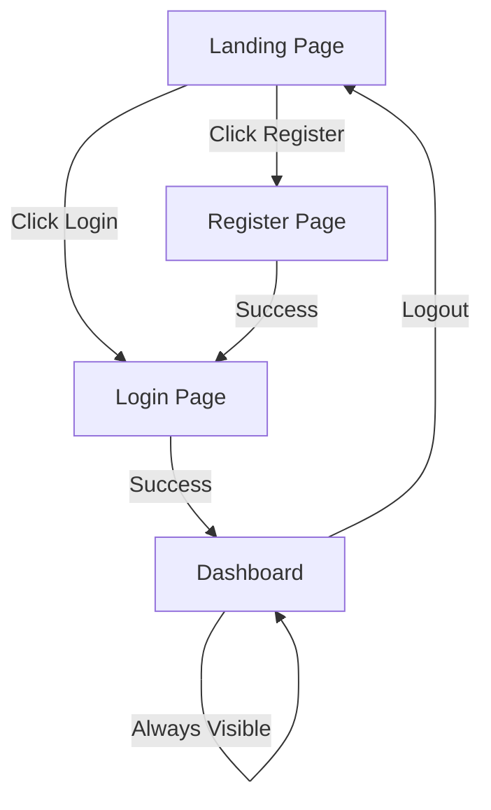

# Frontend Design Document

## Overview

The Task Management Application frontend is a single-page application (SPA) that provides an intuitive interface for users to manage their personal tasks. The design prioritizes simplicity, speed, and accessibility while maintaining a modern aesthetic. The application communicates with the existing Go backend via REST API and uses JWT tokens for authentication.

**Technology Recommendations:**
- Framework: React, Vue, or vanilla JavaScript (designer-agnostic)
- State Management: Context API or lightweight state library
- Styling: CSS modules or Tailwind CSS for responsive design
- HTTP Client: Fetch API or Axios for backend communication

## Architecture

### Application Structure

```
┌─────────────────────────────────────┐
│         Browser (Client)            │
│  ┌───────────────────────────────┐  │
│  │   Frontend Application        │  │
│  │  ┌─────────────────────────┐  │  │
│  │  │  Authentication Layer   │  │  │
│  │  │  (JWT Token Management) │  │  │
│  │  └─────────────────────────┘  │  │
│  │  ┌─────────────────────────┐  │  │
│  │  │   Routing Layer         │  │  │
│  │  │   (Page Navigation)     │  │  │
│  │  └─────────────────────────┘  │  │
│  │  ┌─────────────────────────┐  │  │
│  │  │   UI Components         │  │  │
│  │  │   (Pages & Widgets)     │  │  │
│  │  └─────────────────────────┘  │  │
│  │  ┌─────────────────────────┐  │  │
│  │  │   API Service Layer     │  │  │
│  │  │   (HTTP Requests)       │  │  │
│  │  └─────────────────────────┘  │  │
│  └───────────────────────────────┘  │
└─────────────────────────────────────┘
              │
              │ HTTPS/REST API
              ▼
┌─────────────────────────────────────┐
│      Go Backend Server              │
│   (Existing Implementation)         │
└─────────────────────────────────────┘
```

### Page Structure and Navigation Flow



The application consists of 4 main pages:

1. **Landing Page** - Public welcome page
2. **Login Page** - Authentication for existing users
3. **Register Page** - New user account creation
4. **Dashboard** - Main task management interface (authenticated only)

## Components and Interfaces

### 1. Landing Page

**Purpose:** First impression and entry point for unauthenticated users

**Layout:**
```
┌────────────────────────────────────────┐
│           Header/Logo                  │
├────────────────────────────────────────┤
│                                        │
│         Hero Section                   │
│    "Manage Your Tasks Simply"          │
│                                        │
│    [Get Started] [Login]               │
│                                        │
├────────────────────────────────────────┤
│     Feature Highlights (Optional)      │
│   • Simple task management             │
│   • Secure authentication              │
│   • Access anywhere                    │
└────────────────────────────────────────┘
```

**Components:**
- **Header**: Application logo/name, navigation links
- **Hero Section**: Headline, subheadline, call-to-action buttons
- **CTA Buttons**: 
  - "Get Started" → Navigate to Register Page
  - "Login" → Navigate to Login Page

**Design Notes:**
- Clean, minimal design with ample whitespace
- Primary CTA button should be visually prominent
- Mobile: Stack buttons vertically, reduce hero text size

---

### 2. Login Page

**Purpose:** Authenticate existing users

**Layout:**
```
┌────────────────────────────────────────┐
│           Header/Logo                  │
├────────────────────────────────────────┤
│                                        │
│         Login Form (Centered)          │
│    ┌──────────────────────────┐        │
│    │  Username: [_________]   │        │
│    │  Password: [_________]   │        │
│    │                          │        │
│    │  [Login Button]          │        │
│    │                          │        │
│    │  Don't have an account?  │        │
│    │  [Register here]         │        │
│    └──────────────────────────┘        │
│                                        │
└────────────────────────────────────────┘
```

**Components:**
- **Login Form Card**: Centered container with shadow/border
  - Username input field (text)
  - Password input field (password type)
  - Login button (primary style)
  - Link to Register page
- **Error Message Area**: Display authentication errors above form

**Interactions:**
- Form validation on submit
- Display loading spinner on button during API call
- Show error message for invalid credentials
- Redirect to Dashboard on success

**Design Notes:**
- Form should be 400-500px wide on desktop, full-width on mobile
- Use clear error messages: "Invalid username or password"
- Password field should have show/hide toggle icon
- Disable submit button while request is in progress

---

### 3. Register Page

**Purpose:** Create new user accounts

**Layout:**
```
┌────────────────────────────────────────┐
│           Header/Logo                  │
├────────────────────────────────────────┤
│                                        │
│      Registration Form (Centered)      │
│    ┌──────────────────────────┐        │
│    │  Username: [_________]   │        │
│    │  Password: [_________]   │        │
│    │  Confirm:  [_________]   │        │
│    │                          │        │
│    │  [Create Account]        │        │
│    │                          │        │
│    │  Already have account?   │        │
│    │  [Login here]            │        │
│    └──────────────────────────┘        │
│                                        │
└────────────────────────────────────────┘
```

**Components:**
- **Registration Form Card**: Centered container
  - Username input field
  - Password input field
  - Confirm password input field
  - Create Account button (primary style)
  - Link to Login page
- **Validation Messages**: Real-time feedback below each field

**Interactions:**
- Client-side validation:
  - Username: minimum 3 characters, no special characters
  - Password: minimum 8 characters
  - Confirm password: must match password field
- Display success message on successful registration
- Auto-redirect to Login page after 2 seconds
- Show error if username already exists

**Design Notes:**
- Match styling with Login page for consistency
- Show password strength indicator (optional enhancement)
- Display validation errors inline below each field
- Success message: "Account created! Redirecting to login..."

---

### 4. Dashboard (Main Application)

**Purpose:** Primary interface for task management

**Layout (Desktop):**
```
┌─────────────────────────────────────────────────┐
│  Header: [Logo] Task Manager    [User] [Logout] │
├─────────────────────────────────────────────────┤
│                                                 │
│  ┌───────────────────────────────────────────┐  │
│  │  Add New Task                             │  │
│  │  [________________________] [Add Button]  │  │
│  └───────────────────────────────────────────┘  │
│                                                 │
│  ┌───────────────────────────────────────────┐  │
│  │  Task List                                │  │
│  │  ┌─────────────────────────────────────┐  │  │
│  │  │ [✓] Task 1 description    [Edit][X] │  │  │
│  │  ├─────────────────────────────────────┤  │  │
│  │  │ [ ] Task 2 description    [Edit][X] │  │  │
│  │  ├─────────────────────────────────────┤  │  │
│  │  │ [✓] Task 3 description    [Edit][X] │  │  │
│  │  └─────────────────────────────────────┘  │  │
│  └───────────────────────────────────────────┘  │
│                                                 │
└─────────────────────────────────────────────────┘
```

**Layout (Mobile):**
```
┌──────────────────────────┐
│ ☰  Task Manager  [Logout]│
├──────────────────────────┤
│                          │
│ [_______________] [+]    │
│                          │
│ ┌──────────────────────┐ │
│ │[✓] Task 1            │ │
│ │    [Edit] [Delete]   │ │
│ ├──────────────────────┤ │
│ │[ ] Task 2            │ │
│ │    [Edit] [Delete]   │ │
│ └──────────────────────┘ │
│                          │
└──────────────────────────┘
```

**Components:**

#### A. Header Bar
- **Logo/Title**: Application name (left side)
- **User Info**: Display username (right side)
- **Logout Button**: Clear button to end session (right side)
- **Mobile**: Hamburger menu for user info and logout

#### B. Task Input Section
- **Input Field**: Large text input for task description
  - Placeholder: "What needs to be done?"
  - Auto-focus on page load
- **Add Button**: Primary button with "+" icon or "Add" text
- **Validation**: Prevent empty task submission

#### C. Task List Container
- **Empty State**: When no tasks exist
  - Icon (checklist or clipboard)
  - Message: "No tasks yet. Add one above to get started!"
- **Task Items**: List of all user tasks

#### D. Task Item Component
Each task displays:
- **Checkbox**: Toggle completion status
  - Unchecked: Empty circle or square
  - Checked: Filled with checkmark
- **Description**: Task text
  - Completed tasks: Strike-through styling
  - Incomplete tasks: Normal text
- **Edit Button**: Icon button (pencil icon)
- **Delete Button**: Icon button (trash/X icon)

**Task Item States:**
1. **Normal State**: Display mode with all elements visible
2. **Edit State**: Description becomes editable input field
   - Show Save and Cancel buttons
   - Hide Edit and Delete buttons temporarily
3. **Loading State**: Dim task while API request in progress
4. **Completed State**: Visual differentiation (strike-through, muted color)

**Interactions:**

1. **Adding a Task:**
   - User types description → clicks Add
   - Show loading spinner on button
   - Optimistically add task to list (with temporary ID)
   - Update with real ID from API response
   - Clear input field on success
   - Show error toast if fails

2. **Toggling Task Status:**
   - User clicks checkbox
   - Immediately update visual state (optimistic)
   - Send API request in background
   - Revert if API fails, show error toast

3. **Editing a Task:**
   - User clicks Edit button
   - Task description becomes editable input
   - Show Save and Cancel buttons
   - Save: Send update to API, return to normal state
   - Cancel: Revert changes, return to normal state

4. **Deleting a Task:**
   - User clicks Delete button
   - Show confirmation dialog: "Delete this task?"
   - Confirm: Remove from list, send delete to API
   - Show error toast if API fails, restore task

**Design Notes:**
- Maximum width: 800px for task list on large screens (centered)
- Task items: 60-70px height for comfortable touch targets
- Spacing: 16px between task items
- Completed tasks: Move to bottom of list (optional)
- Animations: Smooth transitions for add/remove (200-300ms)
- Colors:
  - Completed tasks: Gray/muted
  - Incomplete tasks: Full color
  - Delete button: Red/danger color
  - Edit button: Blue/neutral color

---

## Data Models

### Frontend State Structure

```typescript
// User Authentication State
interface AuthState {
  isAuthenticated: boolean;
  token: string | null;
  username: string | null;
}

// Task Model (matches backend)
interface Task {
  id: number;
  description: string;
  done: boolean;
}

// Application State
interface AppState {
  auth: AuthState;
  tasks: Task[];
  loading: boolean;
  error: string | null;
}

// UI State for Task Editing
interface TaskUIState {
  editingTaskId: number | null;
  editingDescription: string;
}
```

### API Request/Response Formats

**Authentication:**
```typescript
// POST /api/register
Request: { username: string, password: string }
Response: { message: string }

// POST /api/login
Request: { username: string, password: string }
Response: { token: string }
```

**Task Operations:**
```typescript
// GET /api/tasks
Headers: { Authorization: "Bearer <token>" }
Response: Task[]

// POST /api/tasks
Headers: { Authorization: "Bearer <token>" }
Request: { description: string }
Response: { id: number, description: string, done: boolean }

// PUT /api/tasks/:id
Headers: { Authorization: "Bearer <token>" }
Request: { description?: string, done?: boolean }
Response: { message: string }

// DELETE /api/tasks/:id
Headers: { Authorization: "Bearer <token>" }
Response: { message: string }
```

## Error Handling

### Error Types and User Messages

| Error Scenario | User-Facing Message | Action |
|---------------|---------------------|--------|
| Network failure | "Unable to connect. Check your internet connection." | Show retry button |
| 401 Unauthorized | "Session expired. Please log in again." | Redirect to login |
| 400 Bad Request | "Invalid input. Please check your data." | Highlight field |
| 404 Not Found | "Task not found. It may have been deleted." | Refresh list |
| 500 Server Error | "Something went wrong. Please try again." | Show retry button |
| Timeout (>5s) | "Request timed out. Please try again." | Show retry button |

### Error Display Components

**Toast Notifications:**
- Position: Top-right corner
- Duration: 5 seconds (auto-dismiss for errors), 3 seconds (success)
- Style: Red background for errors, green for success
- Include close button (X)

**Inline Errors:**
- Form validation: Red text below input field
- Icon: Warning triangle or exclamation mark

**Modal Dialogs:**
- Critical errors only (e.g., session expired)
- Overlay with centered modal
- Single action button to acknowledge

## Testing Strategy

### Designer Deliverables Checklist

The designer should provide mockups for:

1. **Landing Page**
   - Desktop view (1920px, 1440px, 1024px)
   - Mobile view (375px, 414px)

2. **Login Page**
   - Normal state
   - Error state (invalid credentials)
   - Loading state

3. **Register Page**
   - Normal state
   - Validation error states
   - Success state

4. **Dashboard**
   - Empty state (no tasks)
   - Populated state (5-10 tasks, mix of complete/incomplete)
   - Task editing state
   - Mobile responsive view
   - Error state (failed to load tasks)

5. **Components**
   - Task item (normal, completed, editing, loading)
   - Buttons (primary, secondary, danger, disabled)
   - Input fields (normal, focus, error)
   - Toast notifications (success, error)
   - Confirmation dialog

6. **Design System**
   - Color palette (primary, secondary, success, error, neutral shades)
   - Typography scale (headings, body, small text)
   - Spacing system (margins, padding)
   - Border radius values
   - Shadow/elevation levels
   - Icon set

### Responsive Breakpoints

- **Mobile**: 320px - 767px
- **Tablet**: 768px - 1023px
- **Desktop**: 1024px and above

### Accessibility Requirements

- **Color Contrast**: WCAG AA compliant (4.5:1 for text)
- **Focus States**: Visible outline on all interactive elements
- **Keyboard Navigation**: Tab order follows visual flow
- **Screen Reader**: ARIA labels on icon buttons
- **Touch Targets**: Minimum 44x44px on mobile

### Animation Guidelines

- **Duration**: 200-300ms for most transitions
- **Easing**: ease-in-out for smooth motion
- **Use Cases**:
  - Task add/remove: Slide and fade
  - Checkbox toggle: Scale animation
  - Page transitions: Fade
  - Loading states: Spinner or skeleton screens

## Design Decisions and Rationales

### Single-Page Application (SPA)
**Decision**: Build as SPA rather than multi-page application
**Rationale**: Provides smoother user experience with instant navigation, reduces server load, and aligns with modern web development practices. Task management benefits from real-time updates without page refreshes.

### Optimistic UI Updates
**Decision**: Update UI immediately before API confirmation
**Rationale**: Creates perception of instant response, improving user experience. Particularly important for checkbox toggles which should feel immediate. Revert on failure with error notification.

### Minimal Navigation
**Decision**: Single dashboard page for all task operations
**Rationale**: Task management is the core function. Keeping everything on one page reduces cognitive load and navigation friction. Users can see all tasks and perform all actions without context switching.

### Token Storage
**Decision**: Store JWT in localStorage (with consideration for httpOnly cookies)
**Rationale**: localStorage provides simple persistence across sessions. For production, recommend httpOnly cookies for enhanced security against XSS attacks. Document both approaches for developer.

### Mobile-First Design
**Decision**: Design mobile layouts first, then scale up
**Rationale**: Ensures core functionality works on smallest screens. Task management is often used on-the-go, making mobile experience critical.

### No Task Filtering/Sorting (MVP)
**Decision**: Display all tasks in simple list, completed tasks at bottom
**Rationale**: Keeps MVP scope manageable. Can add filtering (active/completed) and sorting (date, priority) in future iterations based on user feedback.

### Inline Editing
**Decision**: Edit tasks inline rather than modal dialog
**Rationale**: Faster workflow, less disruptive. Users can quickly fix typos or update descriptions without losing context of other tasks.

### Confirmation for Delete Only
**Decision**: Require confirmation for delete, but not for status toggle or edit
**Rationale**: Delete is irreversible and high-risk. Status toggle and edit are easily reversible, so confirmation would add unnecessary friction.
